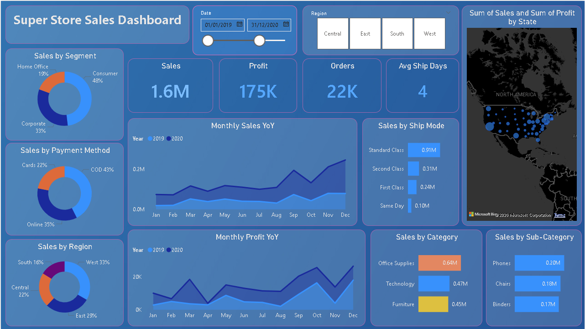

# 📊 Sales Performance Dashboard

## 🔷 Business Objective
Deliver a clear, interactive view of sales performance to support data-driven decision-making across products, regions, and time.

## 🔷 Tools & Technologies
- Power BI  
- Data Cleaning & Transformation  
- DAX (Data Analysis Expressions)  

## 🔷 Dashboard Capabilities
- KPI tracking: Revenue, Profit, Quantity, Profit Margin  
- Time-based analysis: Monthly, Quarterly, Yearly trends  
- Product performance: Top vs underperforming items  
- Regional insights: Geographic contribution to revenue  
- Interactive filtering for dynamic exploration  

## 🔷 Key Insights
- Revenue is highly concentrated among a small set of products  
- Certain regions consistently outperform others  
- Sales trends indicate clear seasonal patterns  
- Underperforming categories present optimization opportunities  

## 🔷 Dashboard Preview

## 🔷 Repository Structure
- `/data` → Raw dataset  
- `/dashboard` → Power BI file (.pbix)  
- `/images` → Dashboard screenshots  

## 🔷 Outcome
This project demonstrates the ability to transform raw data into actionable business intelligence and deliver insights through an interactive dashboard.